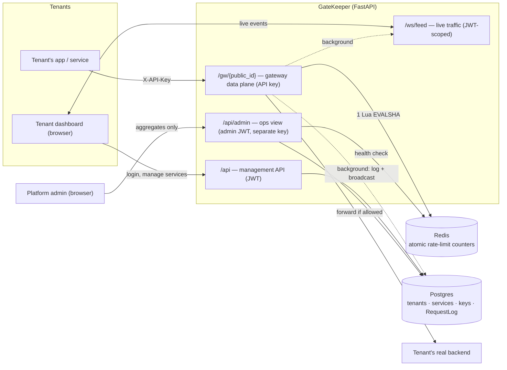

# GateKeeper

Multi-tenant API rate-limiting gateway — tenants register a backend, configure a
rate-limit policy (token bucket / sliding window counter), and route traffic through
GateKeeper, which enforces the limit atomically via Redis and forwards allowed
requests to their real backend.

This is a learning-focused infrastructure project. See `GATEKEEPER_BRIEF.md` for the
full product vision and `PROGRESS.md` for current build status.

## Architecture



Two data stores, two roles: **Postgres** is the system of record (tenants, services,
policies, keys, request history); **Redis** is scoped to one job — atomic distributed
rate-limit counters — never caching or pub/sub. Three separate identities gate the
three planes above (see next section).

## Stack
- Backend: Python 3.12, FastAPI, SQLAlchemy 2.0 (async), PostgreSQL, Alembic, Pydantic v2
- Rate-limit core: Redis + Lua scripting (atomic check-and-increment)
- Reverse proxy: httpx (async, streaming)
- Real-time: FastAPI WebSockets (per-tenant scoped)
- Frontend: React + TypeScript, TanStack Query, Tailwind, Recharts
- Infra: Docker Compose (full stack), GitHub Actions CI (backend + frontend + image builds),
  structured JSON logging with request-id correlation, Sentry (opt-in)

## Three separate identities (kept apart on purpose)
1. **Tenant dashboard auth** — JWT, signed with `SECRET_KEY`. Tenant users log in
   to manage their services.
2. **Gateway auth** — per-service API keys authenticating traffic through the proxy.
3. **Platform admin auth** — JWT signed with a **different key**, `ADMIN_SECRET_KEY`.
   No public signup; provision the first admin with:
   ```bash
   cd backend && python -m scripts.create_admin --email you@company.com
   ```

## API (so far)

Dashboard API, JWT bearer unless noted:

| Method | Path | Notes |
|---|---|---|
| POST | `/api/auth/register` | → access token (creates tenant + owner user) |
| POST | `/api/auth/login` | → access token |
| GET | `/api/auth/me` | current user + tenant |
| GET | `/api/services` | tenant's services only |
| POST | `/api/services` | create service + rate-limit rule |
| GET·PATCH·DELETE | `/api/services/{id}` | 404 (not 403) for other tenants' services |
| PUT | `/api/services/{id}/rule` | replace the policy |
| GET·POST | `/api/services/{id}/keys` | POST returns the plaintext key **once** |
| DELETE | `/api/services/{id}/keys/{key_id}` | revoke |
| GET | `/api/services/{id}/stats?minutes=N` | per-minute request/block series + totals |
| WS | `/ws/feed?token=<jwt>` | live per-tenant traffic feed — isolation enforced server-side |
| GET | `/health` | no auth; reports Redis reachability |

Admin API (`ADMIN_SECRET_KEY`-signed bearer, separate from the tenant JWT above):

| Method | Path | Notes |
|---|---|---|
| POST | `/api/admin/auth/login` | → admin access token (no public registration) |
| GET | `/api/admin/me` | current admin |
| GET | `/api/admin/overview` | system-wide aggregates only — see below |

Rate-limit rule: `algorithm` (`token_bucket` \| `sliding_window_counter`), `limit`,
`window_seconds`, optional `burst` (≥ `limit`). API keys are stored as SHA-256 hashes.

**Gateway (data plane):** `{ANY} /gw/{public_id}/{path}` — send your service's API
key as `X-API-Key` or `Authorization: Bearer`. GateKeeper rate-checks per client IP,
then forwards to your `upstream_url` and streams the response back, or returns `429`
with `Retry-After`. `502`/`504` if your backend is unreachable / slow. Every call is
logged (`RequestLog`) for the dashboard.

## Rate limiting (`app/rate_limit/`)

One interface — `RateLimiter.check(key, *, cost=1, now=None) -> RateLimitResult` — with
two implementations selected per service by `factory.get_rate_limiter`:

- **token bucket** — `capacity` tokens (= `burst` or `limit`) refilling at
  `limit / window_seconds` per second; allows bursts, holds the long-run average.
- **sliding window counter** — `limit` per rolling `window_seconds` via the
  two-counter approximation (O(1) memory, no per-request timestamp log).

Each `check` is a single **Lua script** run by Redis, so read-decide-write is atomic —
no check-then-act race under concurrent load. `now` is passed in (not read via
`redis.call('TIME')`) so the scripts are deterministic and testable without sleeping.
`tests/integration/test_rate_limit.py` fires 250 concurrent checks and asserts the
admitted count is *exactly* the limit — and includes a naive non-atomic version that
provably over-admits.

## Gateway hot path (`app/gateway/`)

Per proxied request: **1 indexed DB read** (API-key hash → service + rule),
**1 Redis round-trip** (the Lua check), **1 pooled upstream call** (shared
`httpx.AsyncClient`). Request logging and the `last_used_at` touch run as a
background task *after* the response. Hop-by-hop headers and the gateway's own
credentials are stripped before forwarding; `X-Forwarded-For/-Host` are added.

If Redis is unreachable the gateway **fails open** by default (request allowed,
`X-RateLimit-Bypassed: true`) — configurable to fail closed (`503`).

## Live dashboard (`app/ws/`)

Each proxied request is pushed to the owning tenant's dashboard sockets by an
in-process `ConnectionManager` (`{tenant_id: {sockets}}`). A socket's tenant comes
from its verified JWT — never from the client — so a tenant only ever sees its own
traffic. Single-process fan-out for the demo; at scale each node would publish to
Redis pub/sub (or a message bus) and re-fan-out locally.

## Platform admin (`app/api/routers/admin.py`)

Separate identity from tenants (see above) and separate visibility: `/api/admin/overview`
returns tenant/service counts, 24h request/blocked/error-rate/avg-latency, Redis + DB
health, a platform-wide 60-minute requests series, and tenants at ≥80% of their plan's
daily request quota (`app/core/plans.py`) — **aggregates only**, never a path, client IP,
or any other per-request detail. The endpoint degrades (`db_ok`/`redis_ok: false`)
rather than failing outright if a backend is unhealthy.

## Hardening (`app/core/`)

- **Structured logging** (`logging.py`) — plain text locally (`LOG_JSON=false`, the
  default, for a readable terminal), one JSON object per line in containers
  (`LOG_JSON=true`). Every line — ours and uvicorn's — carries the same `request_id`
  via a context-var-backed filter, and every response echoes it back as
  `X-Request-ID` (`request_context.py`), so one request's logs are one `grep` away.
- **Sentry** (`sentry.py`) — strictly opt-in; a no-op unless `SENTRY_DSN` is set, so
  local dev and CI never need a Sentry account.
- **SSRF guard** (`net_safety.py`) — a tenant's `upstream_url` can be checked against
  loopback/private/link-local/metadata-endpoint addresses before a service is
  created or updated. Off by default (`BLOCK_PRIVATE_UPSTREAMS=false`) since a local
  dev/demo upstream is very often loopback; turn it on in production. Best-effort —
  documented in `net_safety.py` why it doesn't stop DNS rebinding.

## Local dev

Backend + frontend dev servers against just Postgres/Redis in Docker (fastest
inner loop, hot reload on both sides):

```bash
cd backend
python -m venv .venv && source .venv/bin/activate
pip install -e ".[dev]"
cp .env.example .env
docker compose up -d db redis        # from repo root
alembic upgrade head
uvicorn app.main:app --reload
pytest
```

```bash
cd frontend
npm install
npm run dev          # proxies /api, /gw, /ws to localhost:8000
```

Or the full stack in containers (what a deploy actually runs):

```bash
docker compose up -d --build
# frontend: http://localhost:8080 (nginx, reverse-proxies /api,/gw,/ws to backend)
# backend:  http://localhost:8000 (migrations run automatically on boot)
```

## Scaling notes (what would change at real scale)
- Redis colocated with gateway nodes; an explicit bounded connection pool sized to
  worker concurrency (currently redis-py's unbounded default).
- Postgres read replicas for dashboard/analytics queries.
- `RequestLog` moved to a TSDB / short-retention store, not the primary DB; the admin
  stats queries pre-aggregated into rollups instead of scanning raw rows.
- Live feed fanned out via Redis pub/sub (or a message bus) across gateway/dashboard
  nodes instead of one process's in-memory `ConnectionManager`.
- Migrations run as a separate release step, not on every container boot (the
  `docker-entrypoint.sh` here is a single-instance-demo convenience).
- Multi-region gateway with regional Redis (out of scope for v1).

The full, phase-by-phase list of every demo-scale simplification and the reasoning
behind each one lives in `PROGRESS.md`.
